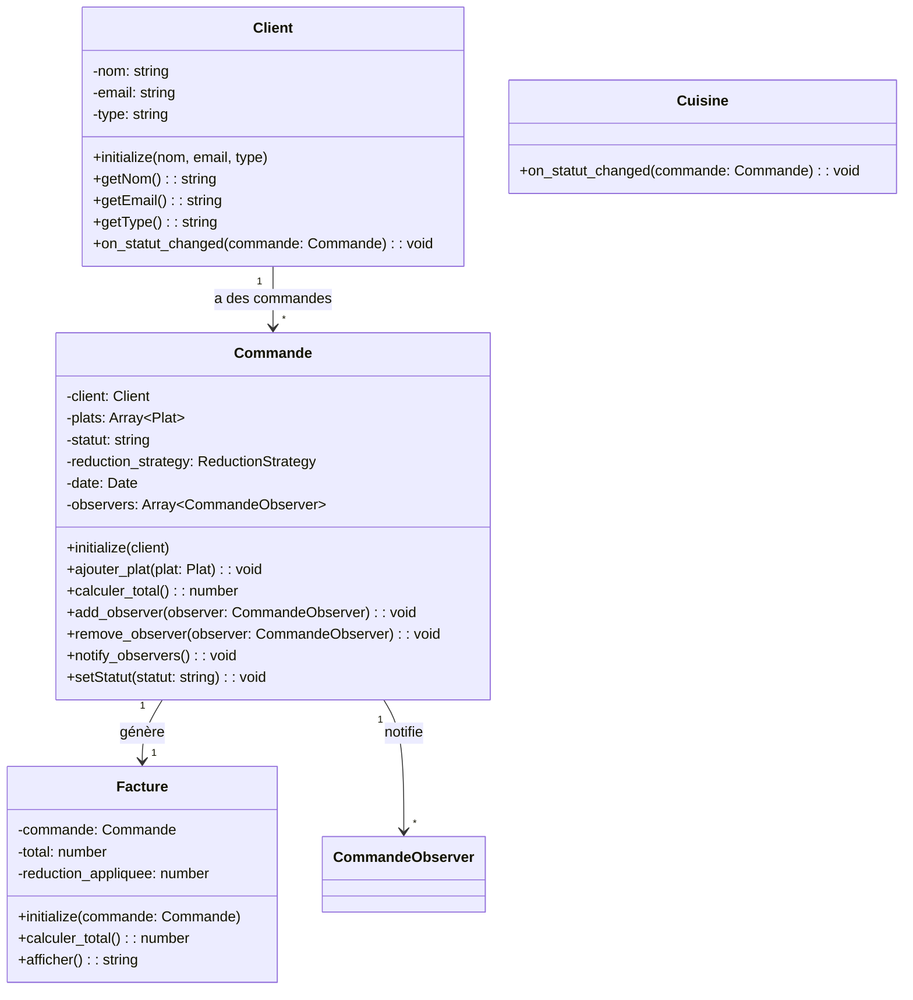

### Classes Principales

```mermaid
classDiagram
    class Client {
        -nom: string
        -email: string
        -type: string
        +initialize(nom, email, type)
        +getNom(): string
        +getEmail(): string
        +getType(): string
        +on_statut_changed(commande: Commande): void
    }
    
    class Commande {
        -client: Client
        -plats: Array~Plat~
        -statut: string
        -reduction_strategy: ReductionStrategy
        -date: Date
        -observers: Array~CommandeObserver~
        +initialize(client)
        +ajouter_plat(plat: Plat): void
        +calculer_total(): number
        +add_observer(observer: CommandeObserver): void
        +remove_observer(observer: CommandeObserver): void
        +notify_observers(): void
        +setStatut(statut: string): void
    }
    
    class Facture {
        -commande: Commande
        -total: number
        -reduction_appliquee: number
        +initialize(commande: Commande)
        +calculer_total(): number
        +afficher(): string
    }
    
    class Cuisine {
        +on_statut_changed(commande: Commande): void
    }
    
    Client "1" --> "*" Commande : a des commandes
    Commande "1" --> "1" Facture : génère
    Commande "1" --> "*" CommandeObserver : notifie
```
