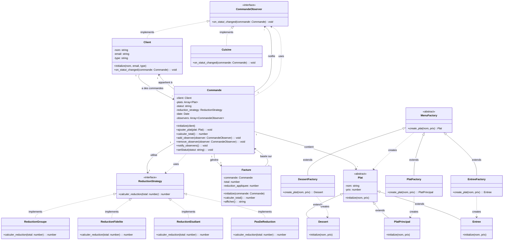

# Diagramme UML Complet - Système Restaurant

```mermaid
classDiagram
    %% ============================================
    %% MODULES / INTERFACES
    %% ============================================
    
    class CommandeObserver {
        <<interface>>
        +on_statut_changed(commande: Commande)* void
    }
    
    class ReductionStrategy {
        <<interface>>
        +calculer_reduction(total: number)* number
    }
    
    %% ============================================
    %% CLASSES PRINCIPALES
    %% ============================================
    
    class Client {
        -nom: string
        -email: string
        -type: string
        +initialize(nom, email, type)
        +on_statut_changed(commande: Commande): void
    }
    
    class Cuisine {
        +on_statut_changed(commande: Commande): void
    }
    
    class Commande {
        -client: Client
        -plats: Array~Plat~
        -statut: string
        -reduction_strategy: ReductionStrategy
        -date: Date
        -observers: Array~CommandeObserver~
        +initialize(client)
        +ajouter_plat(plat: Plat): void
        +calculer_total(): number
        +add_observer(observer: CommandeObserver): void
        +remove_observer(observer: CommandeObserver): void
        +notify_observers(): void
        +setStatut(statut: string): void
    }
    
    class Facture {
        -commande: Commande
        -total: number
        -reduction_appliquee: number
        +initialize(commande: Commande)
        +calculer_total(): number
        +afficher(): string
    }
    
    %% ============================================
    %% FACTORY METHOD PATTERN
    %% ============================================
    
    class Plat {
        <<abstract>>
        -nom: string
        -prix: number
        +initialize(nom, prix)
    }
    
    class Entree {
        +initialize(nom, prix)
    }
    
    class PlatPrincipal {
        +initialize(nom, prix)
    }
    
    class Dessert {
        +initialize(nom, prix)
    }
    
    class MenuFactory {
        <<abstract>>
        +create_plat(nom, prix)* Plat
    }
    
    class EntreeFactory {
        +create_plat(nom, prix): Entree
    }
    
    class PlatFactory {
        +create_plat(nom, prix): PlatPrincipal
    }
    
    class DessertFactory {
        +create_plat(nom, prix): Dessert
    }
    
    %% ============================================
    %% STRATEGY PATTERN
    %% ============================================
    
    class PasDeReduction {
        +calculer_reduction(total: number): number
    }
    
    class ReductionEtudiant {
        +calculer_reduction(total: number): number
    }
    
    class ReductionFidelite {
        +calculer_reduction(total: number): number
    }
    
    class ReductionGroupe {
        +calculer_reduction(total: number): number
    }
    
    %% ============================================
    %% RELATIONS - CLASSES PRINCIPALES
    %% ============================================
    
    Client "1" --> "*" Commande : a des commandes
    Commande "*" --> "1" Client : appartient à
    Commande "1" --> "*" Plat : contient
    Commande "1" --> "1" Facture : génère
    Facture "1" --> "1" Commande : basée sur
    
    %% ============================================
    %% RELATIONS - FACTORY METHOD
    %% ============================================
    
    Plat <|-- Entree : extends
    Plat <|-- PlatPrincipal : extends
    Plat <|-- Dessert : extends
    
    MenuFactory <|-- EntreeFactory : extends
    MenuFactory <|-- PlatFactory : extends
    MenuFactory <|-- DessertFactory : extends
    
    MenuFactory ..> Plat : creates
    EntreeFactory ..> Entree : creates
    PlatFactory ..> PlatPrincipal : creates
    DessertFactory ..> Dessert : creates
    
    %% ============================================
    %% RELATIONS - OBSERVER
    %% ============================================
    
    CommandeObserver <|.. Cuisine : implements
    CommandeObserver <|.. Client : implements
    Commande "1" --> "*" CommandeObserver : notifie
    Commande ..> CommandeObserver : uses
    
    %% ============================================
    %% RELATIONS - STRATEGY
    %% ============================================
    
    ReductionStrategy <|.. PasDeReduction : implements
    ReductionStrategy <|.. ReductionEtudiant : implements
    ReductionStrategy <|.. ReductionFidelite : implements
    ReductionStrategy <|.. ReductionGroupe : implements
    
    Commande "1" --> "1" ReductionStrategy : utilise
    Commande ..> ReductionStrategy : uses
```

