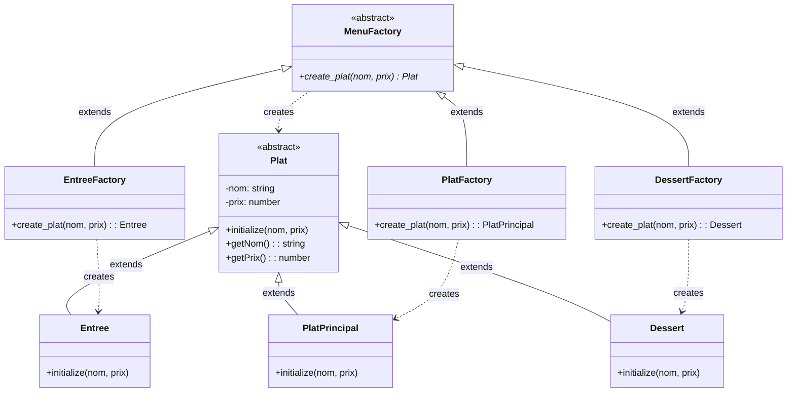

# 🏭 Diagramme Factory Method - Partie Plat

```mermaid
classDiagram
    %% ============================================
    %% PRODUCT (Produit) - Hiérarchie des Plats
    %% ============================================
    
    class Plat {
        <<abstract>>
        -nom: string
        -prix: number
        +initialize(nom, prix)
        +getNom(): string
        +getPrix(): number
    }
    
    class Entree {
        +initialize(nom, prix)
    }
    
    class PlatPrincipal {
        +initialize(nom, prix)
    }
    
    class Dessert {
        +initialize(nom, prix)
    }
    
    %% ============================================
    %% CREATOR (Créateur) - Hiérarchie des Factories
    %% ============================================
    
    class MenuFactory {
        <<abstract>>
        +create_plat(nom, prix)* Plat
    }
    
    class EntreeFactory {
        +create_plat(nom, prix): Entree
    }
    
    class PlatFactory {
        +create_plat(nom, prix): PlatPrincipal
    }
    
    class DessertFactory {
        +create_plat(nom, prix): Dessert
    }
    
    %% ============================================
    %% RELATIONS - Héritage
    %% ============================================
    
    Plat <|-- Entree : extends
    Plat <|-- PlatPrincipal : extends
    Plat <|-- Dessert : extends
    
    MenuFactory <|-- EntreeFactory : extends
    MenuFactory <|-- PlatFactory : extends
    MenuFactory <|-- DessertFactory : extends
    
    %% ============================================
    %% RELATIONS - Création
    %% ============================================
    
    MenuFactory ..> Plat : creates
    EntreeFactory ..> Entree : creates
    PlatFactory ..> PlatPrincipal : creates
    DessertFactory ..> Dessert : creates
```
