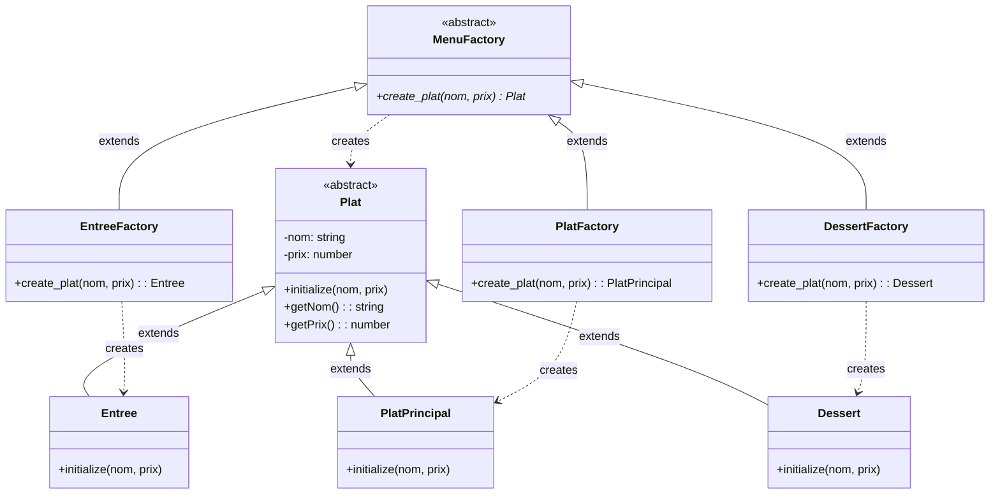
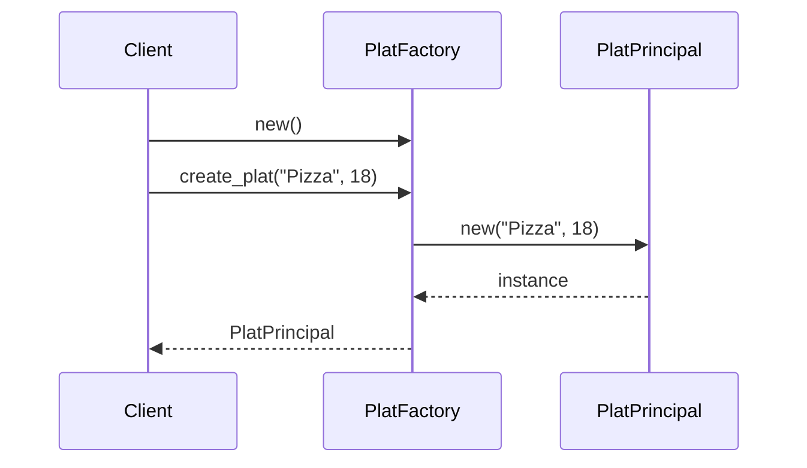

# 🏭 Diagramme Factory Method - Partie Plat

## 📊 Diagramme de Classes - Factory Method Pattern pour les Plats



---

## 🔍 Explication du Pattern

### Structure en 2 hiérarchies

#### 1. Hiérarchie Product (Produit)
```
Plat (abstrait)
  ├── Entree (concret)
  ├── PlatPrincipal (concret)
  └── Dessert (concret)
```

**Rôle** : Définit les types de plats qu'on peut créer.

#### 2. Hiérarchie Creator (Créateur)
```
MenuFactory (abstrait)
  ├── EntreeFactory (concret)
  ├── PlatFactory (concret)
  └── DessertFactory (concret)
```

**Rôle** : Définit comment créer chaque type de plat.

---

## 🔄 Flux de Création

### Exemple : Créer un plat principal

```ruby
# 1. Créer la factory
plat_factory = PlatFactory.new

# 2. Utiliser la factory pour créer un plat
pizza = plat_factory.create_plat("Pizza", 18)

# 3. Résultat : un objet PlatPrincipal
pizza.class  # → PlatPrincipal
pizza.nom    # → "Pizza"
pizza.prix   # → 18
```

### Diagramme de séquence



---

## 🎯 Pourquoi cette structure ?

### Avantages

1. **Séparation des responsabilités**
   - Les factories s'occupent de la création
   - Les plats s'occupent de leurs données

2. **Extensibilité**
   - Ajouter un nouveau type de plat = créer une nouvelle classe + une nouvelle factory
   - Pas besoin de modifier le code existant

3. **Polymorphisme**
   - Toutes les factories ont la même interface (`create_plat`)
   - Tous les plats héritent de `Plat`

### Exemple d'extension

Si tu veux ajouter un "Boisson" :

```ruby
# 1. Créer la classe Product
class Boisson < Plat
    def initialize(nom, prix)
        super(nom, prix)
    end
end

# 2. Créer la Factory
class BoissonFactory < MenuFactory
    def create_plat(nom, prix)
        Boisson.new(nom, prix)
    end
end

# 3. Utilisation
boisson_factory = BoissonFactory.new
coca = boisson_factory.create_plat("Coca", 3)
```

---

## 📝 Récapitulatif des Rôles

| Élément | Rôle dans le Pattern | Exemple |
|---------|---------------------|---------|
| `Plat` | **Product** (abstrait) | Classe de base, ne peut pas être instanciée |
| `Entree`, `PlatPrincipal`, `Dessert` | **ConcreteProduct** | Classes concrètes, peuvent être instanciées |
| `MenuFactory` | **Creator** (abstrait) | Interface pour créer des plats |
| `EntreeFactory`, `PlatFactory`, `DessertFactory` | **ConcreteCreator** | Factories concrètes qui créent des plats spécifiques |

---

## ✅ Points Clés

1. **Plat est abstrait** : On ne peut pas faire `Plat.new()` directement
2. **Chaque Factory crée un type spécifique** : `PlatFactory` crée toujours des `PlatPrincipal`
3. **Même interface** : Toutes les factories ont `create_plat(nom, prix)`
4. **Polymorphisme** : On peut traiter tous les plats comme des `Plat`

---

Ce diagramme montre uniquement la partie Factory Method pour les plats ! 🎯

