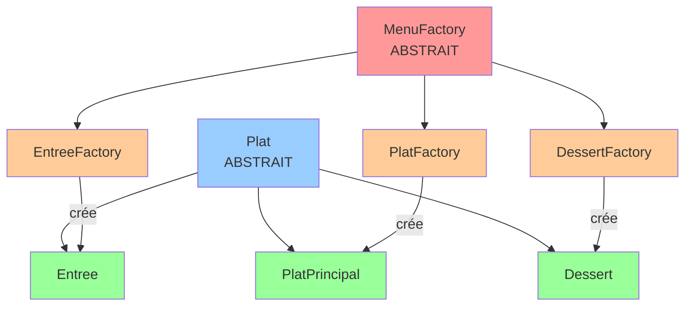

# 🏭 Diagramme Factory Method - Version Simple

## 🎯 L'idée en 1 phrase

**Une Factory crée un type de Plat spécifique.**

---

## 📊 Diagramme Ultra-Simple



**Légende :**
- 🔴 **Rouge** = Classes abstraites (on ne peut pas les utiliser directement)
- 🟠 **Orange** = Factories concrètes (on les utilise pour créer)
- 🟢 **Vert** = Plats concrets (les objets qu'on crée)
- 🔵 **Bleu** = Classe abstraite Plat

---

## 🔄 Comment ça marche ? (Étape par étape)

### Étape 1 : Tu veux créer une Pizza

```ruby
# Tu crées la factory pour les plats principaux
factory = PlatFactory.new
```

### Étape 2 : Tu utilises la factory

```ruby
# La factory crée un PlatPrincipal
pizza = factory.create_plat("Pizza", 18)
```

### Étape 3 : Résultat

```ruby
pizza.class  # → PlatPrincipal
pizza.nom    # → "Pizza"
pizza.prix   # → 18
```

---

## 📋 Tableau Simple

| Tu veux créer... | Tu utilises... | Ça crée... |
|------------------|----------------|------------|
| Une entrée | `EntreeFactory` | Un objet `Entree` |
| Un plat principal | `PlatFactory` | Un objet `PlatPrincipal` |
| Un dessert | `DessertFactory` | Un objet `Dessert` |

---

## 🤔 Pourquoi 2 hiérarchies ?

### Hiérarchie 1 : Les Factories (qui crée)
```
MenuFactory (abstrait)
  ├── EntreeFactory (crée des Entree)
  ├── PlatFactory (crée des PlatPrincipal)
  └── DessertFactory (crée des Dessert)
```

**Rôle** : Définir COMMENT créer

### Hiérarchie 2 : Les Plats (ce qui est créé)
```
Plat (abstrait)
  ├── Entree
  ├── PlatPrincipal
  └── Dessert
```

**Rôle** : Définir QUOI créer

---

## 💡 Analogie Simple

Imagine une **usine de voitures** :

- **MenuFactory** = Le concept d'usine (abstrait)
- **PlatFactory** = Une usine de voitures de sport (concrète)
- **Plat** = Le concept de voiture (abstrait)
- **PlatPrincipal** = Une voiture de sport (concrète)

L'usine de voitures de sport crée des voitures de sport !

---

## ✅ Résumé en 3 points

1. **MenuFactory** (abstrait) → définit le contrat "toutes les factories doivent avoir `create_plat`"
2. **PlatFactory** (concrète) → implémente `create_plat` pour créer des `PlatPrincipal`
3. **Plat** (abstrait) → définit le contrat commun pour tous les plats (nom, prix)

**C'est tout !** 🎯

