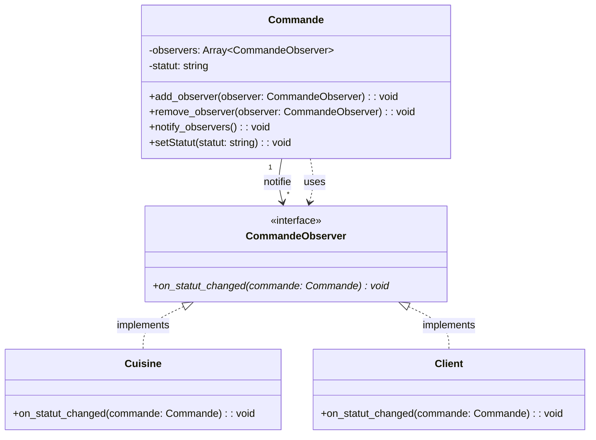

### Observer Pattern : notifications on set status pour la cuisine et client

**Explication** :
- **Subject** : `Commande` (maintient une liste d'observers, notifie lors de changements)
- **Observer** : `CommandeObserver` (interface)
- **ConcreteObservers** : `Cuisine` et `Client` (réagissent aux notifications)

**Flux** : Quand `Commande.setStatut()` est appelé → `notify_observers()` → tous les observateurs (Cuisine et Clients) reçoivent `on_statut_changed()`.

---