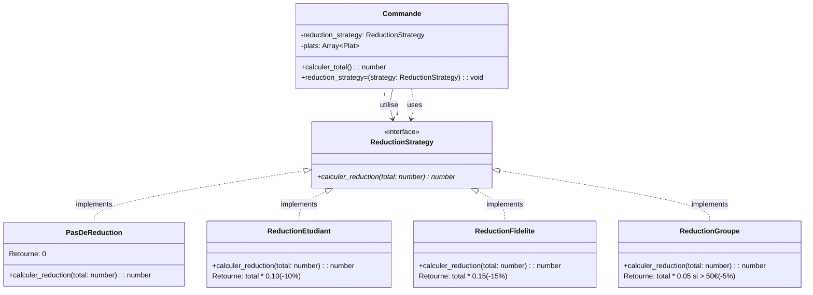

### Strategy Pattern : application des réductions

**Explication** :
- **Strategy** : `ReductionStrategy` (interface)
- **ConcreteStrategies** : `PasDeReduction`, `ReductionEtudiant`, `ReductionFidelite`, `ReductionGroupe`
- **Context** : `Commande` (délègue le calcul de réduction à la stratégie)

**Usage** : `Commande.calculer_total()` délègue à `@reduction_strategy.calculer_reduction()`.

---
