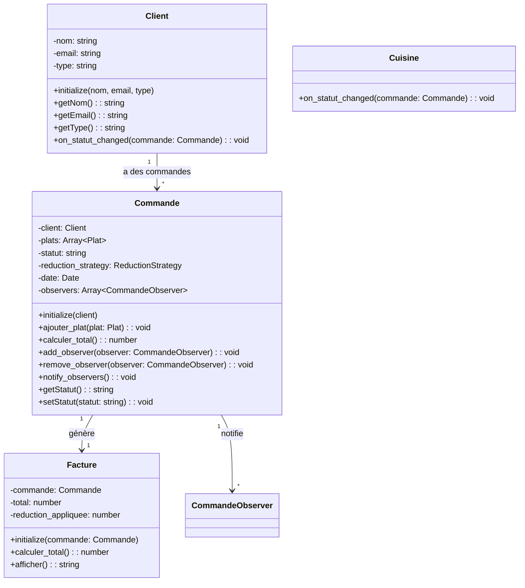
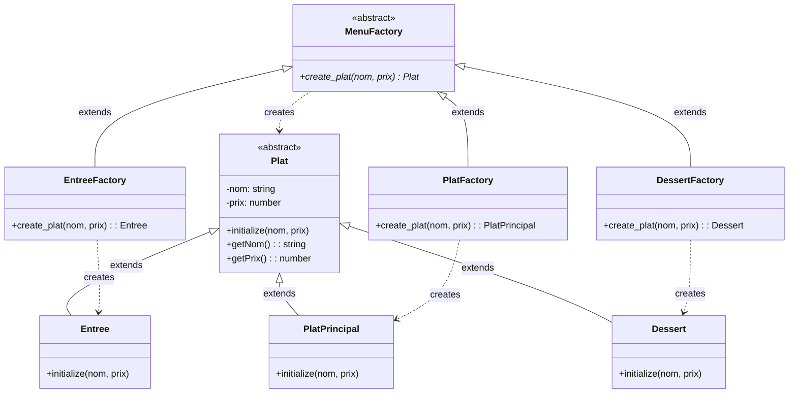
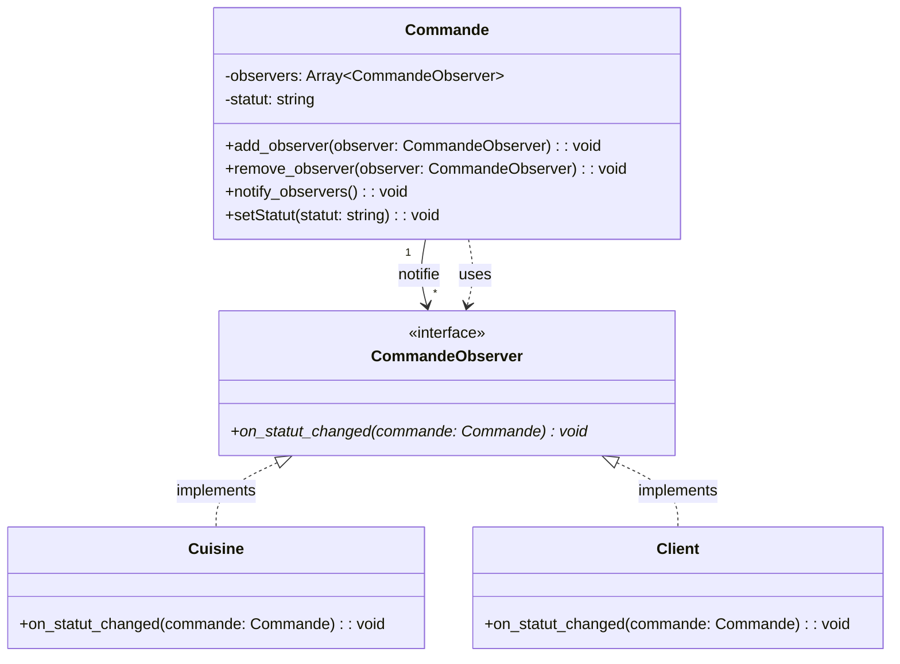
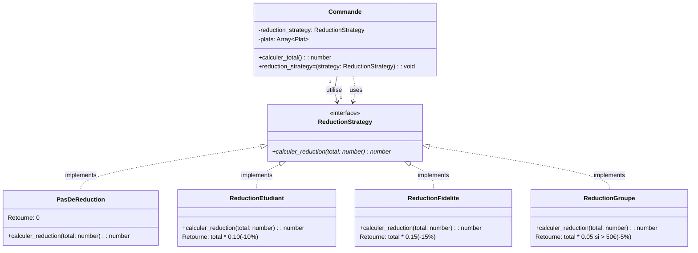
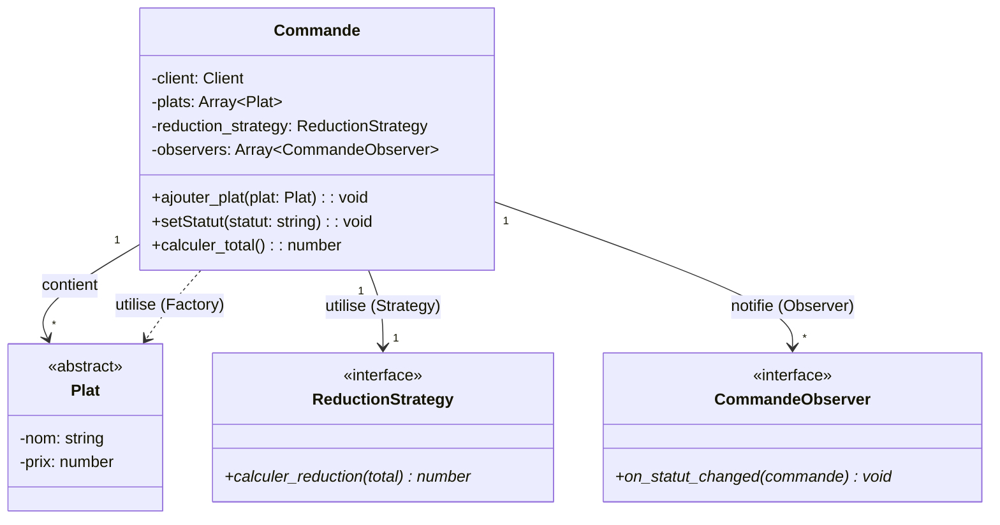
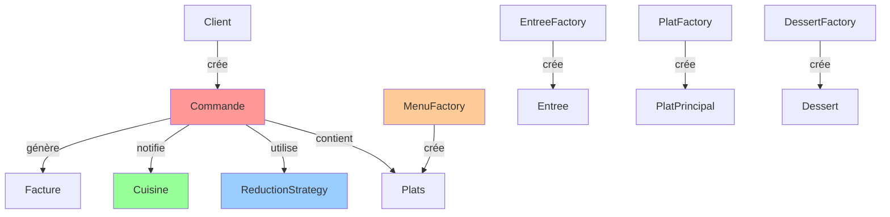

# 🍽️ Diagramme UML - Système de Gestion de Commandes Restaurant

## 📊 Diagramme de Classes Complet

```mermaid
classDiagram
    %% ============================================
    %% CLASSES PRINCIPALES
    %% ============================================
    
    class Client {
        -nom: string
        -email: string
        -type: string
        +initialize(nom, email, type)
        +getNom(): string
        +getEmail(): string
        +getType(): string
        +on_statut_changed(commande: Commande): void
    }
    
    class Commande {
        -client: Client
        -plats: Array~Plat~
        -statut: string
        -reduction_strategy: ReductionStrategy
        -date: Date
        -observers: Array~CommandeObserver~
        +initialize(client)
        +ajouter_plat(plat: Plat): void
        +calculer_total(): number
        +add_observer(observer: CommandeObserver): void
        +remove_observer(observer: CommandeObserver): void
        +notify_observers(): void
        +getStatut(): string
        +setStatut(statut: string): void
    }
    
    class Facture {
        -commande: Commande
        -total: number
        -reduction_appliquee: number
        +initialize(commande: Commande)
        +calculer_total(): number
        +afficher(): string
    }
    
    class Cuisine {
        +on_statut_changed(commande: Commande): void
    }
    
    %% ============================================
    %% FACTORY METHOD PATTERN
    %% ============================================
    
    class Plat {
        <<abstract>>
        -nom: string
        -prix: number
        +initialize(nom, prix)
        +getNom(): string
        +getPrix(): number
    }
    
    class Entree {
        +initialize(nom, prix)
    }
    
    class PlatPrincipal {
        +initialize(nom, prix)
    }
    
    class Dessert {
        +initialize(nom, prix)
    }
    
    class MenuFactory {
        <<abstract>>
        +create_plat(nom, prix)* Plat
    }
    
    class EntreeFactory {
        +create_plat(nom, prix): Entree
    }
    
    class PlatFactory {
        +create_plat(nom, prix): PlatPrincipal
    }
    
    class DessertFactory {
        +create_plat(nom, prix): Dessert
    }
    
    %% ============================================
    %% OBSERVER PATTERN
    %% ============================================
    
    class CommandeObserver {
        <<interface>>
        +on_statut_changed(commande: Commande)* void
    }
    
    %% ============================================
    %% STRATEGY PATTERN
    %% ============================================
    
    class ReductionStrategy {
        <<interface>>
        +calculer_reduction(total: number)* number
    }
    
    class PasDeReduction {
        +calculer_reduction(total: number): number
    }
    
    class ReductionEtudiant {
        +calculer_reduction(total: number): number
    }
    
    class ReductionFidelite {
        +calculer_reduction(total: number): number
    }
    
    class ReductionGroupe {
        +calculer_reduction(total: number): number
    }
    
    %% ============================================
    %% RELATIONS - CLASSES PRINCIPALES
    %% ============================================
    
    Client "1" --> "*" Commande : a des commandes
    Commande "*" --> "1" Client : appartient à
    Commande "1" --> "*" Plat : contient
    Commande "1" --> "1" Facture : génère
    Facture "1" --> "1" Commande : basée sur
    
    %% ============================================
    %% RELATIONS - FACTORY METHOD
    %% ============================================
    
    Plat <|-- Entree : extends
    Plat <|-- PlatPrincipal : extends
    Plat <|-- Dessert : extends
    
    MenuFactory <|-- EntreeFactory : extends
    MenuFactory <|-- PlatFactory : extends
    MenuFactory <|-- DessertFactory : extends
    
    MenuFactory ..> Plat : creates
    EntreeFactory ..> Entree : creates
    PlatFactory ..> PlatPrincipal : creates
    DessertFactory ..> Dessert : creates
    
    %% ============================================
    %% RELATIONS - OBSERVER
    %% ============================================
    
    CommandeObserver <|.. Cuisine : implements
    CommandeObserver <|.. Client : implements
    Commande "1" --> "*" CommandeObserver : notifie
    Commande ..> CommandeObserver : uses
    
    %% ============================================
    %% RELATIONS - STRATEGY
    %% ============================================
    
    ReductionStrategy <|.. PasDeReduction : implements
    ReductionStrategy <|.. ReductionEtudiant : implements
    ReductionStrategy <|.. ReductionFidelite : implements
    ReductionStrategy <|.. ReductionGroupe : implements
    
    Commande "1" --> "1" ReductionStrategy : utilise
    Commande ..> ReductionStrategy : uses
```



---

## 📝 Explications des Relations

### Relations de Composition/Agrégation

- **Client → Commande** : Un client peut avoir plusieurs commandes (1 à *)
- **Commande → Plat** : Une commande contient plusieurs plats (1 à *)
- **Commande → Facture** : Une commande génère une facture (1 à 1)

### Relations d'Héritage (Factory Method)

- **Plat ← Entree, PlatPrincipal, Dessert** : Les plats concrets héritent de Plat
- **MenuFactory ← EntreeFactory, PlatFactory, DessertFactory** : Les factories concrètes héritent de MenuFactory

### Relations d'Implémentation (Observer)

- **CommandeObserver ← Cuisine** : Cuisine implémente l'interface CommandeObserver
- **CommandeObserver ← Client** : Client implémente l'interface CommandeObserver

### Relations d'Implémentation (Strategy)

- **ReductionStrategy ← PasDeReduction, ReductionEtudiant, etc.** : Les stratégies concrètes implémentent ReductionStrategy

### Relations d'Utilisation

- **Commande → ReductionStrategy** : Commande utilise une stratégie de réduction
- **Commande → CommandeObserver** : Commande notifie les observateurs
- **MenuFactory → Plat** : Les factories créent des plats

---

## 🎯 Les 3 Patterns dans le Diagramme

### 1. Factory Method Pattern
```
MenuFactory (Creator)
  ├── EntreeFactory (ConcreteCreator)
  ├── PlatFactory (ConcreteCreator)
  └── DessertFactory (ConcreteCreator)

Plat (Product)
  ├── Entree (ConcreteProduct)
  ├── PlatPrincipal (ConcreteProduct)
  └── Dessert (ConcreteProduct)
```

**Rôle** : Créer des plats de différents types via des factories spécialisées.

### 2. Observer Pattern
```
Commande (Subject)
  - observers: Array
  - add_observer()
  - remove_observer()
  - notify_observers()

Cuisine (Observer)
  - on_statut_changed(commande)

Client (Observer)
  - on_statut_changed(commande)
```

**Rôle** : Notifier la cuisine et les clients quand le statut d'une commande change.

### 3. Strategy Pattern
```
ReductionStrategy (Strategy)
  ├── PasDeReduction
  ├── ReductionEtudiant (-10%)
  ├── ReductionFidelite (-15%)
  └── ReductionGroupe (-5% si > 50€)

Commande (Context)
  - reduction_strategy
  - calculer_total()
```

**Rôle** : Appliquer différentes politiques de réduction selon le type de client.

---

## 🔑 Points Clés du Diagramme

1. **Commande** est au centre : elle utilise les 3 patterns
   - Factory : pour créer les plats
   - Observer : pour notifier la cuisine et les clients
   - Strategy : pour calculer les réductions

2. **Séparation des responsabilités** :
   - Factory : création des plats
   - Observer : notification en temps réel
   - Strategy : calcul des réductions

3. **Extensibilité** :
   - Ajouter un nouveau type de plat = nouvelle factory
   - Ajouter un nouvel observateur = implémenter CommandeObserver
   - Ajouter une nouvelle réduction = implémenter ReductionStrategy

---

## ✅ Validation de l'Architecture

- [x] Toutes les classes principales modélisées
- [x] Factory Method pattern complet
- [x] Observer pattern complet
- [x] Strategy pattern complet
- [x] Relations clairement définies
- [x] Méthodes principales indiquées
- [x] Architecture cohérente et extensible

**L'architecture est prête pour l'implémentation ! 🚀**

---

## 🔍 Zooms sur les Patterns et Classes

### 📦 Zoom 1 : Classes Principales



**Explication** : Les classes principales du système. `Commande` est au centre et utilise les patterns.

---

### 🏭 Zoom 2 : Factory Method Pattern



**Explication** : 
- **Creator** : `MenuFactory` (abstrait)
- **ConcreteCreators** : `EntreeFactory`, `PlatFactory`, `DessertFactory`
- **Product** : `Plat` (abstrait)
- **ConcreteProducts** : `Entree`, `PlatPrincipal`, `Dessert`

**Usage** : Chaque factory crée un type de plat spécifique.

---

### 👁️ Zoom 3 : Observer Pattern



**Explication** :
- **Subject** : `Commande` (maintient une liste d'observers, notifie lors de changements)
- **Observer** : `CommandeObserver` (interface)
- **ConcreteObservers** : `Cuisine` et `Client` (réagissent aux notifications)

**Flux** : Quand `Commande.setStatut()` est appelé → `notify_observers()` → tous les observateurs (Cuisine et Clients) reçoivent `on_statut_changed()`.

---

### 🎯 Zoom 4 : Strategy Pattern



**Explication** :
- **Strategy** : `ReductionStrategy` (interface)
- **ConcreteStrategies** : `PasDeReduction`, `ReductionEtudiant`, `ReductionFidelite`, `ReductionGroupe`
- **Context** : `Commande` (délègue le calcul de réduction à la stratégie)

**Usage** : `Commande.calculer_total()` délègue à `@reduction_strategy.calculer_reduction()`.

---

### 🔗 Zoom 5 : Relation Commande et ses Patterns



**Explication** : `Commande` est au centre et utilise les 3 patterns :
- **Factory** : Les plats sont créés via les factories
- **Observer** : Notifie les observateurs (Cuisine et Clients) lors des changements de statut
- **Strategy** : Utilise une stratégie de réduction pour calculer le total

---

## 📊 Vue d'Ensemble Simplifiée



**Légende** :
- 🔴 **Rouge** : Commande (classe centrale)
- 🔵 **Bleu** : Strategy Pattern
- 🟢 **Vert** : Observer Pattern
- 🟠 **Orange** : Factory Pattern

---

Ces zooms permettent de mieux comprendre chaque partie du système ! 🎯

